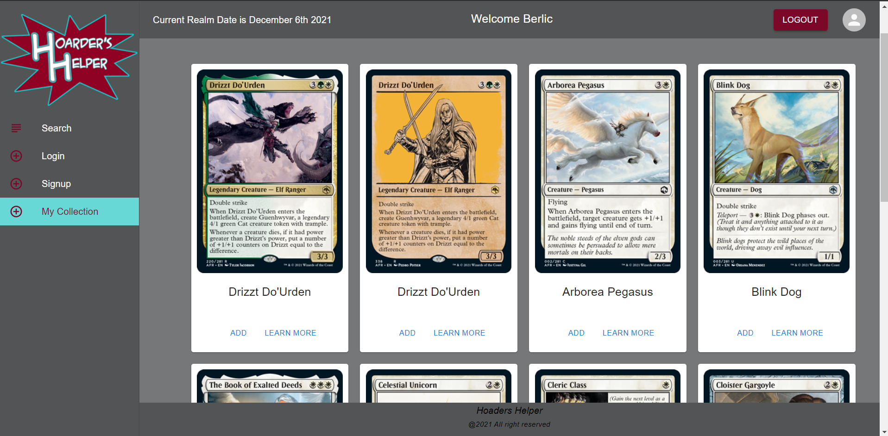

# Hoarders Helper

## User Story
AS AN avid Magic The Gathering card collector
I WANT to search for new cards and add to my collection
SO THAT I can keep a list of the cards I have

## Table of Contents 
- [Technology](#techology)
- [Usage](#usage)
- [License](#license)
- [Contributing](#contributing)
- [Question](#questions)

## Technology Stack:
- MongoDB
- Heroku
- Node.js
- Express.js
- Apollo
- React

### Usage:
[HoardersHelper](https://hoardershelper.herokuapp.com/)
 
Create an account to add cards and view your collection

## Licence:
[MIT](./LICENSE)        

## Contributors:
Brandon Sorrel
Skylar Harwell
Ufuoma Ekemike

## Github Name:
https://github.com/BerlicTheHunter/HoardersHelper

## Email Address:
bsorrell3@gmail.com
randompinkerton@gmail.com
uekemike@yahoo.com

## Questions
If you have any questions about the repo, open an issue or contact us directly at hoardershelperapp@gmail.com. You can find details of  this work and this project at
https://github.com/BerlicTheHunter/HoardersHelper

Copyright 2021 &copy;